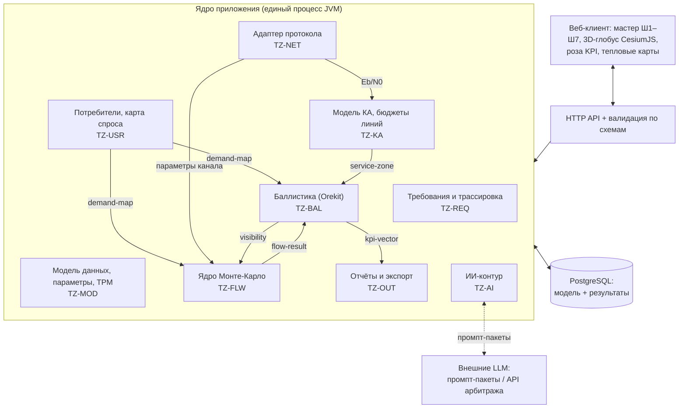

# Архитектура ИС

Статус: Draft. Источник: ТЗ (75 требований), Концепция v0.3.
Решения зафиксированы в ADR-010…ADR-015.

---

## 1. Определяющее ограничение

Архитектуру определяет **TZ-COM-004**: эталонный прогон (60 КА, 20 000 ячеек спроса, 24 ч, 1000 реализаций Монте-Карло) — не дольше 5 минут. Оценка вариантов реализации:

| Подход | Оценка | Вывод |
| --- | --- | --- |
| Видимость перебором пар «КА × ячейка × шаг» | ~10¹⁰ проверок, ≈2 мин | съедает половину бюджета |
| Видимость от положений КА с пространственным индексом | ~3·10⁸ пар, ≈3 с | приемлемо |
| Видимость на грубой сетке (двухуровневая) | ~6·10⁶ пар, ≈0,1 с | принято (ADR-013) |
| МК полным перебором сообщений | 4·10¹¹ событий | нереализуемо |
| МК по представителям + аналитика на ячейку | 4·10⁹ событий, ≈10 с на 8 ядрах | принято (ADR-014) |

Отсюда два решения, определяющие всю расчётную часть: **двухуровневая сетка видимости** и **гибридное аналитико-имитационное ядро**. Всё остальное — следствия.

## 2. Общая схема



Стрелки между модулями — это ровно контракты из `schemas/contracts/`; других путей обмена нет (TZ-COM-007).

## 3. Стек и развёртывание

| Слой | Решение | Обоснование |
| --- | --- | --- |
| Ядро | Kotlin/JVM | Orekit — Java-библиотека: работа без моста; JIT даёт скорость, нужную для МК |
| Хранилище | PostgreSQL: JSONB + таблица связей | Документы валидируются схемами, трассировка — рекурсивными CTE |
| Клиент | TypeScript/React + CesiumJS | 3D-глобус, трассы, зоны; данные — из Orekit через CZML |
| Развёртывание | Один процесс + БД; воркеры — только для пакетных trade studies | Модульный монолит (ADR-012) |

Отвергнутые варианты: Python-ядро (недостаточная скорость МК, мост к Orekit), микросервисы (операционная сложность без выигрыша при лёгкой модульности), графовая СУБД (граф трассировки — тысячи узлов, рекурсивных CTE достаточно).

## 4. Расчётный конвейер

**Этап 1. Предрасчёт геометрии** (баллистика, один раз на сценарий)
Пропагация Orekit → положения КА с шагом 10 с → видимость на грубой сетке (~800×800 км) → уточнение до ячеек спроса по границе зоны обслуживания из `service-zone` → расписание `visibility` (пролёты, тени, окна ISL). Результат кэшируется по ключу «конфигурация группировки + эпоха + версия Orekit».

**Этап 2. Аналитика на ячейку** (детерминированная)
Для каждой ячейки и пролёта: предложенная нагрузка из карты спроса × профили активности; вероятность коллизии и ёмкость из адаптера протокола; замыкание бюджета линии. Это даёт детерминированный «скелет», по которому МК не пересчитывает то, что не случайно.

**Этап 3. Монте-Карло по представителям** (стохастическая часть)
Разыгрываются только те измерения, где случайность существенна: всплески событий, цепочки повторов с эфемеридным backoff, бюджет времени реакции C', деградация терминалов по возрасту альманаха. Вместо перебора всех терминалов — выборка представителей с весами по численности популяции.

**Этап 4. Свёртка в KPI**
`flow-result` → спрос-взвешенное качество по классам → `kpi-vector` → Парето-фронт и роза.

## 5. Воспроизводимость при параллельности

Требования TZ-FLW-002 (побитовая воспроизводимость) и TZ-COM-004 (скорость) конфликтуют при обычном ГПСЧ: результат начинает зависеть от порядка выполнения потоков.

Решение — **счётчиковый ГПСЧ** (Philox/Threefry): поток случайных чисел адресуется парой «зерно сценария × индекс реализации × индекс сущности», а не последовательным состоянием. Реализация k получает свой поток независимо от того, на каком ядре и в каком порядке считается. Параллельность становится безразличной для результата.

## 6. Хранение модели

```
objects(id, type, jsonb doc, status, version, valid_from, valid_to)
links(from_id, to_id, kind)          -- trace, allocation, verification
params(object_id, name, value, unit, provenance jsonb, formula)
results(scenario_id, kind, jsonb payload, stale, input_versions jsonb)
```

- версионность — интервалами `valid_from/valid_to`: Baseline не изменяется, создаётся новая версия (TZ-COM-003);
- трассировка — только в `links`, направление хранится один раз, обратный обход рекурсивным CTE (принцип, проверенный на самом ТЗ: дублирование направлений ведёт к расхождению);
- валидация JSONB по схемам — на границе API (TZ-MOD-002);
- `results.stale` выставляется при изменении входов через граф зависимостей параметров (TZ-MOD-005).

## 7. Внешние компоненты

| Компонент | Роль | Примечание |
| --- | --- | --- |
| Orekit | Пропагация, события, тени | Apache 2.0; собственных пропагаторов нет (TZ-BAL-001) |
| CesiumJS | 3D-глобус | Apache 2.0; связка через CZML |
| TAT-C | Эталон метрик покрытия | Только валидация (TZ-BAL-008), не рантайм |
| ns-3 lorawan / FLoRa / ELoRa | Эталон канальной модели | Только числа для калибровки; код GPL не заимствуется (TZ-NET-004) |
| Библиотека ReqIF | Экспорт требований | Выбор реализации и проверка лицензии — при реализации TZ-OUT-005 |
| StrictDoc | Не используется как бэкенд | ADR-015 |

## 8. Риски

| Риск | Проявление | Реакция |
| --- | --- | --- |
| Двухуровневая сетка огрубляет границы зон | Ошибка покрытия у края footprint | Уточнение до ячеек спроса на этапе 1; контроль расхождения с TAT-C (TZ-BAL-008) |
| Выборка представителей смещает хвосты распределений | Занижение P99 задержки | Веса + контроль сходимости по числу представителей; сверка с полным перебором на малом сценарии |
| Кэш геометрии устаревает незаметно | Расчёт по старой конфигурации | Ключ кэша включает версии входов и Orekit; `stale` в результатах |
| Аналитический «скелет» скрывает эффект перегрузки | Занижение доли повторов | Контрольный случай TZ-FLW-004: нелинейный рост повторов при снижении ёмкости |
| Рост карты спроса сверх эталона | Выход за бюджет времени | Регрессия производительности в CI останавливает сборку |

## 9. Порядок реализации

1. Модель данных, хранилище, валидация схем (TZ-MOD, TZ-COM) — основание для всего;
2. Требования и трассировка (TZ-REQ) — первый полезный контур без расчётов;
3. Потребители и карта спроса (TZ-USR) — вход для расчётов;
4. Баллистика: предрасчёт геометрии (TZ-BAL-001…003) + валидация по TAT-C (TZ-BAL-008);
5. КА и адаптер протокола (TZ-KA, TZ-NET) — зоны обслуживания и параметры канала;
6. Ядро Монте-Карло (TZ-FLW) — с регрессией производительности с первого дня;
7. KPI, визуализация, отчёты (TZ-BAL-005…007, TZ-OUT);
8. ИИ-контур (TZ-AI) — поверх сложившейся модели.
